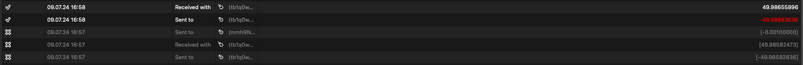
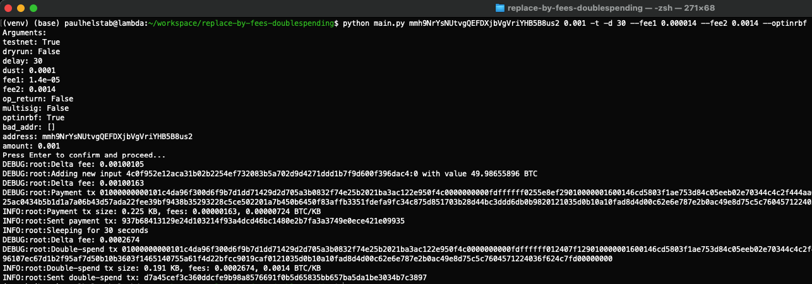

= BIP: 125 (RBF) Bitcoin Double Spending

== Introduction

== Installation

[source,bash]
----
python -m venv venv
pip install -r requirements.txt
----

== Usage

[source,python]
----
# Dryrun / Testrun
python main.py "address" 0.001 -t -n -d 30 --fee1 0.000014 --fee2 0.0014 --optinrbf 

# Real run (remove use -n)
python main.py "address" 0.001 -t -d 30 --fee1 0.000014 --fee2 0.0014 --optinrbf 
----

== Example

link:https://live.blockcypher.com/btc-testnet/tx/3311eba45dc8a6355c412950fa29d96b1f41aba9cfac79f53ee1975a95f8011e/[BlockCypher Transaction Details]

== License
GNU GENERAL PUBLIC LICENSE
Source of Application: https://github.com/petertodd/replace-by-fee-tools
